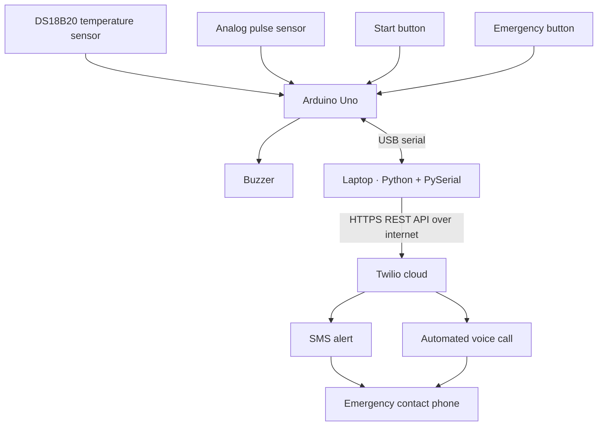

# System block diagram

```mermaid
flowchart TD
    T["DS18B20 temperature sensor"] --> U["Arduino Uno"]
    P["Analog pulse sensor"] --> U
    S["Start button"] --> U
    E["Emergency button"] --> U
    U --> B["Buzzer"]
    U <-->|"USB serial"| PY["Laptop · Python + PySerial"]
    PY -->|"HTTPS REST API over internet"| TW["Twilio cloud"]
    TW --> SMS["SMS alert"]
    TW --> CALL["Automated voice call"]
    SMS --> R["Emergency contact phone"]
    CALL --> R
```

The Arduino performs local acquisition and threshold checks. The laptop is required for the Python process and internet access. Twilio is the cloud communications provider.
